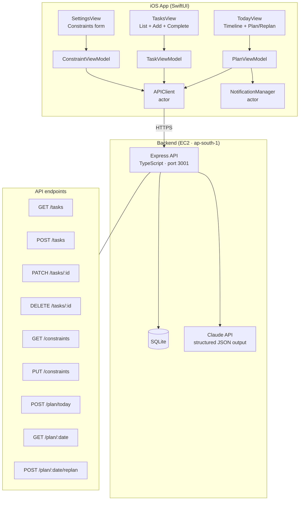
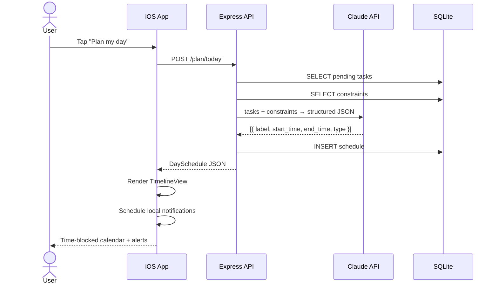

# SmartCal

An AI-powered daily planner. Add tasks, set your schedule constraints, and let Claude generate a time-blocked calendar for your day.

---

## Architecture



### Data flow — "Plan my day"



---

## Project structure

```
SmartCal/
├── App/
│   └── SmartCalApp.swift        @main entry + TabView
├── Networking/
│   ├── APIClient.swift          Swift actor, one method per endpoint
│   └── Endpoints.swift          URL builders, HTTPMethod enum, APIError
├── Models/
│   ├── Task.swift               SCTask · NewTask · TaskPatch
│   ├── Constraint.swift         Constraints (wake/sleep/gym/lunch/deepwork)
│   └── Schedule.swift           ScheduleBlock · DaySchedule · BlockType
├── ViewModels/
│   ├── TaskViewModel.swift      @Observable — task CRUD
│   ├── ConstraintViewModel.swift @Observable — load + save constraints
│   └── PlanViewModel.swift      @Observable — plan/replan + notify
├── Views/
│   ├── Today/
│   │   ├── TodayView.swift      Action bar + empty/planning states
│   │   ├── TimelineView.swift   Vertical scroll, hour grid, time indicator
│   │   └── BlockView.swift      Single colored block
│   ├── Tasks/
│   │   ├── TasksView.swift      List, swipe-delete, skeleton loader
│   │   └── AddTaskView.swift    Sheet form (title/deadline/duration/priority)
│   ├── Settings/
│   │   └── SettingsView.swift   Time pickers, toggles, save toast
│   └── Shared/
│       └── ErrorBanner.swift    .errorBanner(message:) view modifier
└── Notifications/
    └── NotificationManager.swift Swift actor — local notif scheduling
```

---

## Running locally

1. Requires Xcode 16+ (iOS 17 deployment target)
2. Open `SmartCal.xcodeproj`
3. Select your team in **Signing & Capabilities**
4. Choose **iPhone 16 Simulator** → `Cmd+R`

The backend is live at `https://43.205.131.137.nip.io` — no local setup needed.

---

## Stack

| Layer | Technology |
|---|---|
| iOS app | SwiftUI · MVVM · async/await · URLSession |
| Notifications | UserNotifications (local, no server) |
| Backend | Node.js · TypeScript · Express · SQLite |
| AI scheduling | Claude API (structured JSON output) |
| Hosting | AWS EC2 t3.small · ap-south-1 |
| TLS | nip.io wildcard + Let's Encrypt |
